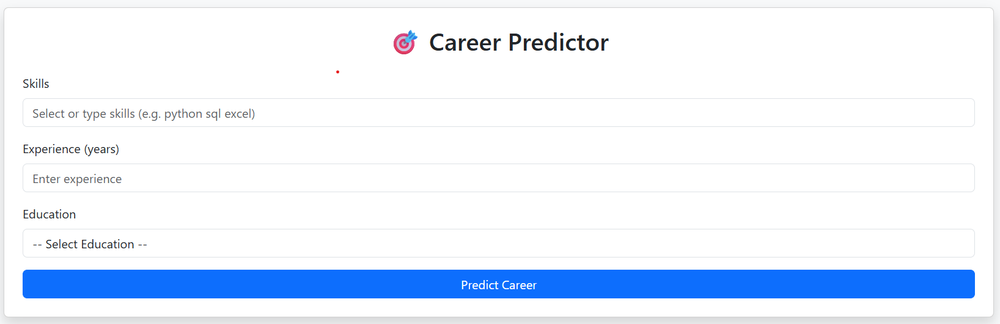
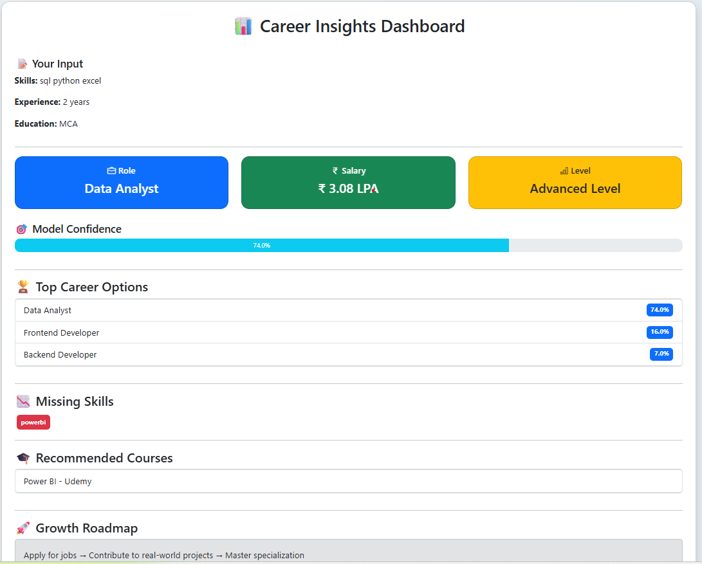
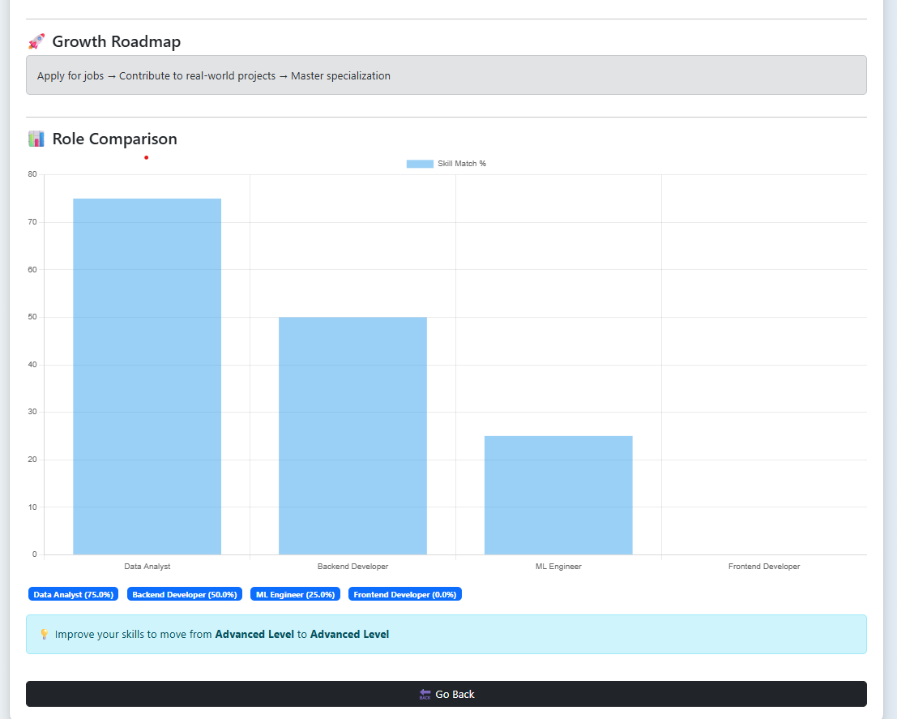

# 🎯 Career Recommendation System (ML + Django)

## 📌 Project Overview

This project is a **Machine Learning based Career Recommendation System** built using **Python & Django**.
It suggests career paths based on user skills and inputs.

---

## 🚀 Features

* 🔍 Skill-based career prediction
* 📊 Machine Learning model integration
* 🌐 Django web interface
* 📈 Future scope: dashboard & analytics

---

## 🛠️ Tech Stack

* Python
* Django
* Scikit-learn
* Pandas
* HTML, CSS

---

## 📂 Project Structure

```
career-ml-project/
│── web/
│── model/
│── templates/
│── static/
│── README.md
```

---

## ⚙️ How to Run

1. Clone the repo

```
git clone https://github.com/your-username/career-ml-project.git
```

2. Go to project folder

```
cd career-ml-project
```

3. Run server

```
python manage.py runserver
```

---

## 📸 Screenshots

### 🏠 Home Page


### 🎯 Result Page



---

## 👩‍💻 Author

* Shilpa Tumma
=======
# AI-Career-Predictor
ML-based career prediction system with Django, skill gap analysis
